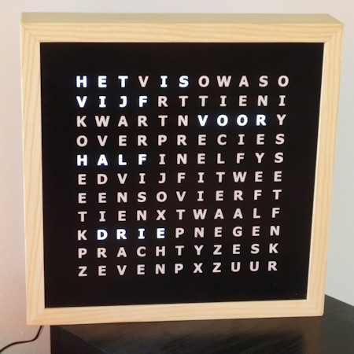

# Word clock white LEDs

Zelfbouw woordklok met witte LEDs. 
 
De diverse versies Arduino code voor de ATMEGA328 of ATMEGA1284-chip gemonteerd op een PCB board bestuurd de 24 LED-strips van de woordklok 
Meer info hier: https://ednieuw.home.xs4all.nl/Woordklok/index.html
or as pdf: Bouwinstructies witlicht woordklok.pdf

De volgende onderdelen worden aangesloten:  
- RCT DS3231 ZS-042 clock module 
- KY-040 Keyes Rotary Encoder 
- LDR light sensor 5528 
- Bluetooth RF Transceiver Module HC05 
- DCF77 module DCF-2 
- FM Stereo Radio Module RDA5807M RRD-102V2.0  
- MAX7219_8DIGIT           // Only with 1284. Not enough pins on ATMEGA328 
- DS1820                   // Only with 1284 

De 74HC595 ULN2803APG combinatie besturen de LED-strips door bits in de 74HC595 te schuiven om de LEDs aan en uit te zetten 
Een FT232RL FTDI USB to TTL Serial Module kan gebruikt worden om de ATMEGA te programmeren 
De HC05/HM-10 Bluetooth-module wordt gebruikt om de klok te besturen en uit te lezen 
Een DCF77-module kan aangesloten worden om de tijd in te stellen via de lange golf 
V1.0.0 is een gestripte versie van V112 met alleen functionaliteit voor een draaiknop, DS3231 klokmodule en LDR
Vanaf versie V112 zijn de functionaliteiten met #defines aan of uit te zetten.

